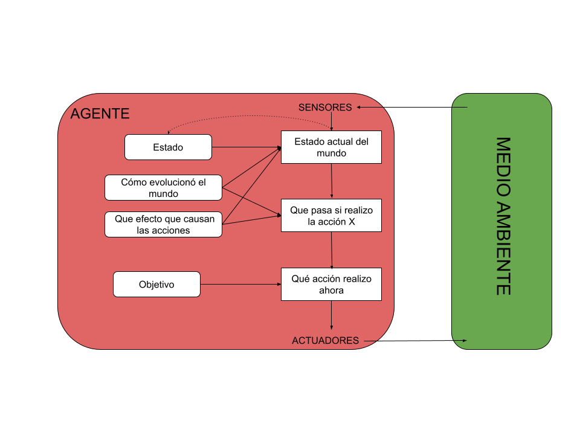

# Quien-es-quien
Práctica del curso de especialización de Inteligencia Artificial y Big Data - IES de Teis

## Preguntas a desarrollar

 * [1. Optimización vs Búsquedas](#1-optimización-vs-búsquedas)
 * [2. Entorno del agente](#2-entorno-del-agente)
 * [3. Algoritmo](#3-algoritmo)
 * [4. Estrutura del agente](#4-estrutura-del-agente)
 * [5. Programación lógica](#5-programación-lógica)
 * [6. Base de datos Prolog](#6-base-de-datos-prolog)
 * [7. Instalación](#7-instalación)

## 1. Optimización vs Búsquedas

El **quien es quien** se puede considerar un problema de optimización, ya que un problema de optimización es aquel que busca encontrar el mejor estado posible según una función objetivo. 

En este caso el juego consiste en encontrar el personaje que seleccionó la otra persona lo antes posible, con lo cual tendriamos que buscar las mejores preguntas para reducir las opciones y encontrar el personaje lo antes posible.

Siendo el mejor estado el conocimiento de la mayor cantidad de información para adivinar el personaje usando las menos preguntas posibles, y la función objetivo es usar las mínimas preguntas para encontrarlo.

Por eso el **quien es quien** es un problema de optimización y no de búsqueda, ya que en este caso buscamos obtener el personaje objetivo con las mínimas preguntas sin la necesidad de hacer una búsqueda completa.

## 2. Entorno del agente

Entorno de tareas | Completamente / parcialmente Observable| Agentes | Determinista / Estocástico | Episódico / Secuencial | Estático / Dinámico | Discreto / Continuo
:---: | :---: | :---: | :---: | :---: | :---: | :---: |
 Quien es quien | Parcialmente observable | Multiagente | Determinista | Secuencial | Estático |  Discreto |

- **Parcialmente observable:** A la hora de empezar el juego el personaje que se debe adivinar es una carta que coje nuestro adversario de forma aleatoria. Con lo cual a medida que pasa el juego nosotros solo podemos observar los personajes que descartamos y los que nos quedan como posibles opciones en nuestro tablero, pero no podemos observar las distintas caracteristicas del personaje objetivo, ni el tablero del adversario para saber las opciones que le quedan.

- **Multiagente:** Mientras está en proceso la partida es necesario la interacción de otro agente, a la hora de realizar preguntas y responderlas para continuar en la búsqueda del personaje que tenemos que adivinar.

- **Determinista:** Puede parecer estocástico ya que al inicio del juego el personaje se coje de forma aleatoria, pero es determinista, ya que en el proceso del juego las preguntas que se realizan tienen respuestas fijas "si" o "no", no existe aleatoriedad en ellas.

- **Secuencial:** Es secuencial debido a que la respuesta de cada pregunta afecta a las siguientes, ya que depende de si es sí o no quedarian unos u otros personajes, los cuales tendrian diferentes características. Lo que afecta directamente a la siguiente pregunta.

- **Estático:** Se trata de un entorno estático ya que mientras se están realizando las preguntas, el entorno no se modifica, como tampoco lo hace el tablero ni el personaje objetivo.

- **Discreto:** Se trata de un agente discreto ya que tiene un número finito de estados. A la hora de seleccionar el personaje, se escoje de una baraja que contiene un número limitado de personajes, además, a la hora de realizar las preguntas también hay un numero limitado, ya que depende de las caracteristicas de los personajes anteriores. Y por último, las respuestas también son limitadas ya que solo pueden ser "si" o "no".

## 3. Algoritmo.

A la hora de realizar el algoritmo, me centre en analizar las caracteristicas totales de la base de datos, contando cuantas veces aparece cada caracteristica entre los personajes que siguen en el tablero. Tras eso decidí seleccionar la caracteristica que se encontraba en el medio para realizar la siguiente pregunta. 

Ya que lo veo más efectivo que si cojemos la que más o menos se repite, ya que si cogieramos estas y tenemos suerte que no la tiene descartariamos muchos personajes pero es bastante más probable que la tenga, con lo cual descartariamos escasos personajes. Así de la forma que hice sabemos que descartaremos la mitad normalmente, ya que sería una caracteristica que la tendrían más o menos la mitad de los personajes.

## 4. Estrutura del agente

El **quien es quien** se adapta perfectamente a las necesidades del agente basado en objetivos. Ya que estes además de obtener la información actual buscan llegar a un objetivo, visualizando las diferentes opciones que tiene y escojiendo la que más le acerque al objetivo deseado.

Basandonos en el **quien es quien**, hay como objetivo descubrir el personaje oculto formulando el mínimo de preguntas posibles, con lo cual partiendo de la información actual, debemos buscar las preguntas que podemos formular viendo las caracteristicas disponibles y elegir la pregunta que nos descarte más personajes para acercarnos lo máximo posible al personaje objetivo o llegar a él.



## 5. Programación lógica

Podemos decir que el paradigma de programación lógica es adecuado para el problema **quien es quien** debido a sus diferentes características. Una de las principales del paradigma es que se centra principalmente en el 'que' del problema, si lo asociamos al **quien es quien**, el 'que' del problema es buscar a través de preguntas al personaje objetivo.

Además, esta compuesto por un conjunto de hechos y reglas, igual quen el **quien es quien** en el cual contamos con un conjunto de caracteristicas de cada personaje del juego y hechos hacia cada persona. Usando estas diferentes caracteristicas, podemos afirmar las características del personaje objetivo o descartar opciones, desta forma cada vez que vayamos formulando preguntas nos vamos acercaremos a las características del personaje objetivo.

## 6. Base de datos Prolog

A la hora de usar la base de datos prolog, en mi caso (quien_es_quien.pl) tuve que cambiarle las ñ por nh ya que a la hora de usarla me daba problemas con el unicode.

La base de datos está compuesta por 24 reglas llamadas personajes, de los cuales hay el nombre y una lista donde estan las caracteristicas que tiene cada uno de ellos.

## 7. Instalación

1. Creamos un directorio y nos situamos en él
```
mkdir quien_es_quien
cd quien_es_quien
```

2. Clonamos el proyecto
```
git clone https://github.com/SamuelAndon/Quien-es-quien.git
```

3. Creamos un entorno virtual con python 3.9 y lo activamos
```
conda create -n quien_es_quien
conda activate quien_es_quien
```

4. Por último instalamos el requirements.txt 
```
conda install --file requirements.txt
pip install git+https://github.com/yuce/pyswip@59016e0841f56177d1b18ec08fd9b67792bd0a97
```  

## Bibliografía

- Russell, Peter. _ARTIFICIAL INTELLIGENCE : A Modern Approach_, Global Edition. S.L., Pearson Education Limited, 2021.
- @dfleta. "quienesquien". _github_. https://github.com/dfleta/quienesquien
- Beginning Java 8 Fundamentals